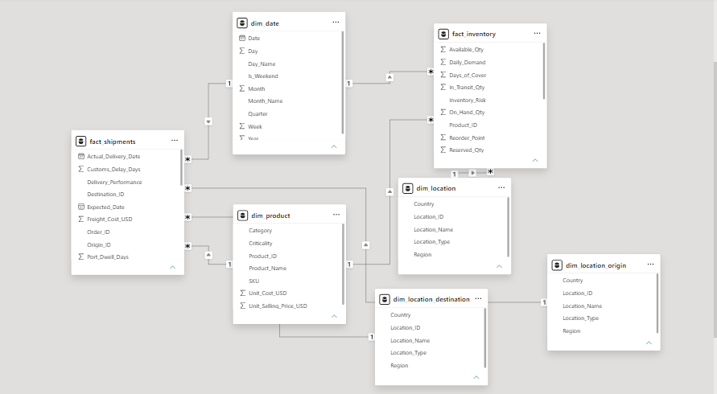
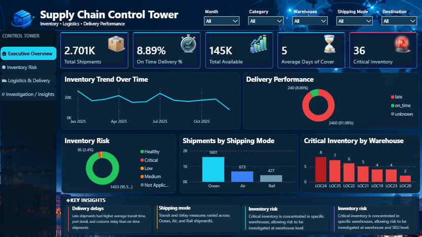
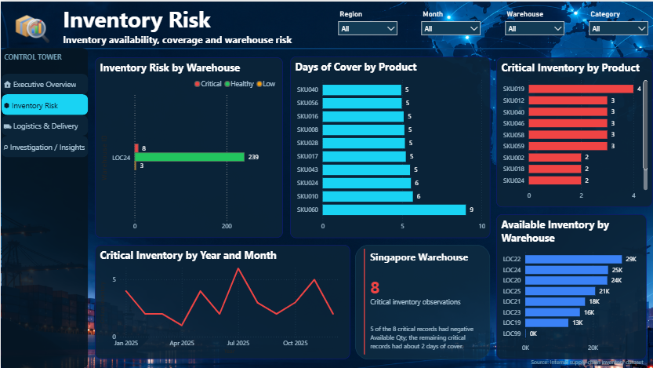
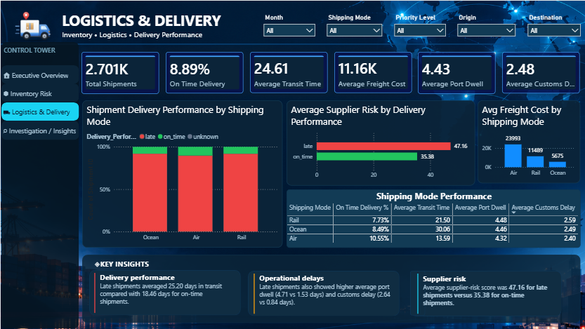
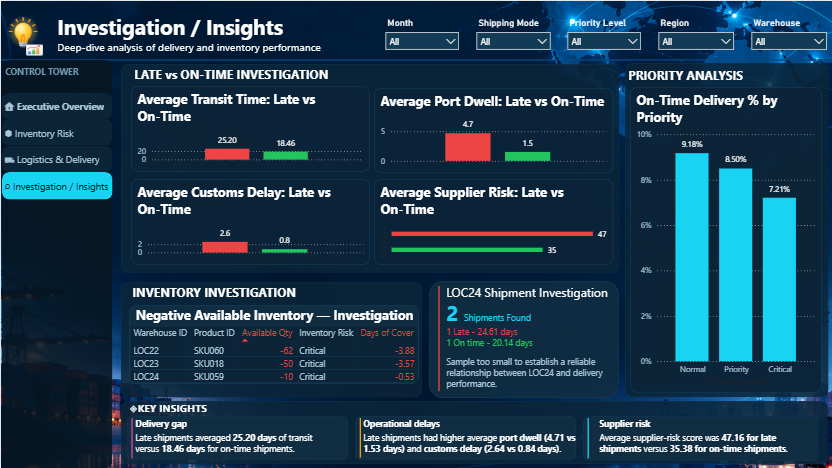

# Supply Chain Control Tower — Inventory & Logistics Performance Analytics

> A Power BI supply-chain analytics project focused on inventory risk, delivery performance, logistics operations, and operational investigation.

## Overview

The **Supply Chain Control Tower** is an end-to-end Power BI analytics project built to turn inventory and shipment data into a practical operational view for decision-making.

The report combines inventory, shipment, logistics, supplier-risk, and delivery-performance analysis into a four-page **Supply Chain Control Tower** dashboard.

The analysis covers **2,701 shipments** and investigates:

- Inventory availability and risk
- Days of cover
- Critical inventory by warehouse and product
- Delivery performance
- Shipping-mode performance
- Transit time
- Port dwell
- Customs delay
- Freight cost
- Supplier risk
- Priority-level delivery performance
- Negative available-inventory records
- Warehouse-level investigation

---

## Business Problem

Supply-chain operations generate large amounts of inventory and shipment information, but operational issues can be difficult to identify when the information is spread across different fields and business dimensions.

This project focuses on using data analysis and Power BI to answer questions such as:

- Where is inventory risk concentrated?
- How well are shipments performing?
- How do shipping modes differ in operational performance?
- Are late shipments associated with longer transit, port dwell, customs delay, or higher supplier-risk scores?
- Which inventory and shipment records require further investigation?

The project follows an analyst workflow:

**Business understanding → Data profiling → Data preparation → Data modeling → Measure development → Analysis → Investigation → Dashboarding → Validation**

---

## Objectives

- Monitor overall shipment and inventory performance
- Identify critical inventory concentrations
- Analyze inventory coverage and availability
- Evaluate on-time delivery performance
- Compare shipping modes
- Analyze transit time, port dwell, and customs delay
- Examine supplier-risk patterns
- Compare delivery performance by priority
- Investigate unusual inventory records
- Build an interactive management-style control-tower dashboard
- Communicate findings through concise business insights

---

## Dataset

The project uses inventory and shipment data containing operational fields for products, locations, dates, shipping modes, delivery performance, inventory levels, delays, freight cost, and supplier-risk information.

The Power BI model separates reusable dimensions from operational fact tables.

### Core model tables

- `dim_date`
- `dim_product`
- `dim_location`
- `dim_location_origin`
- `dim_location_destination`
- `fact_inventory`
- `fact_shipments`

The date dimension supports time-based analysis, while product and location dimensions support consistent filtering and analysis across the operational fact tables.

---

## Tools & Technologies

### Used directly in this project

- **Power BI**
- **Power Query**
- **DAX**
- **Power BI data modeling**
- **Power BI interactive visualizations**

### Analytics skills demonstrated across the learning journey

- **Python**
- **NumPy**
- **Pandas**
- **SQL**

Python, NumPy, Pandas, and SQL were part of the broader analytics development journey surrounding this project. The Power BI report itself was developed using Power Query, DAX, data modeling, and Power BI visualization capabilities.

---

## Data Preparation & Methodology

The project was approached as a practical analytics workflow rather than simply creating visuals.

### Data-quality checks

The preparation and investigation process included:

- Reviewing available columns and field meaning
- Checking missing values
- Checking duplicate records
- Reviewing data types
- Checking categorical consistency
- Reviewing unusual operational values
- Investigating negative inventory values
- Reviewing Unknown / Not Applicable categories
- Validating calculations against the report visuals

### Data transformation

Power Query was used as part of the preparation process to structure and clean the source data before analysis.

The goal was to preserve meaningful operational records while investigating questionable values instead of automatically deleting them.

For example, negative `Available Qty` records were investigated as potential inventory anomalies rather than simply removed.

---

## Data Model

The Power BI model uses fact and dimension tables to support filtering, reusable measures, and analysis across inventory and shipment data.

### Model structure

```text
                    dim_date
                       │
                       │
              ┌────────┴────────┐
              │                 │
        fact_inventory     fact_shipments
              │                 │
              │                 │
        dim_product        dim_product
              │
        dim_location
              │
       ┌──────┴────────┐
       │               │
dim_location_origin   dim_location_destination
```

The actual Power BI model contains:

- `fact_inventory` for inventory-level operational records
- `fact_shipments` for shipment-level operational records
- `dim_date` for time analysis
- `dim_product` for product and category analysis
- `dim_location` for inventory/location analysis
- Separate origin and destination location dimensions for shipment analysis

### Model view



---

## Key Metrics

The report uses measures and calculated metrics to support operational analysis.

Important metrics include:

- Total Shipments
- On-Time Delivery %
- Total Available Inventory
- Average Days of Cover
- Critical Inventory
- Average Transit Time
- Average Freight Cost
- Average Port Dwell
- Average Customs Delay
- Average Supplier Risk
- On-Time Delivery % by Priority
- Inventory Risk classification

The definitions of these metrics are kept consistent across the report.

---

# Dashboard

The final Power BI report contains four pages.

---

## 1. Executive Overview

### Purpose

Provides a high-level control-tower view of overall inventory and shipment performance.

### KPIs

- **Total Shipments:** 2.701K
- **On-Time Delivery:** 8.89%
- **Total Available:** 145K
- **Average Days of Cover:** 5
- **Critical Inventory:** 36

### Visuals

- Inventory Trend Over Time
- Delivery Performance
- Inventory Risk
- Shipments by Shipping Mode
- Critical Inventory by Warehouse
- Key Insights

### Key observations

The page gives management a quick view of shipment performance, inventory risk concentration, shipping-mode distribution, and inventory trends.



---

## 2. Inventory Risk

### Purpose

Focuses on inventory availability, coverage, product risk, and warehouse-level concentration.

### Filters

- Region
- Month
- Warehouse
- Category

### Visuals

- Inventory Risk by Warehouse
- Days of Cover by Product
- Critical Inventory by Product
- Available Inventory by Warehouse
- Critical Inventory by Year and Month
- Warehouse investigation callout

### Confirmed findings

- Critical inventory observations shown in the report: **36**
- Total available inventory: **145K**
- Average days of cover: **5**
- LOC24 had **8 critical inventory observations**
- Only three records were below **-1 Available Qty**

The LOC24 focus was intentional because it represented a meaningful warehouse-level inventory concentration in the analysis.



---

## 3. Logistics & Delivery

### Purpose

Analyzes shipment delivery performance and the operational characteristics associated with shipment outcomes.

### KPIs

- **Total Shipments:** 2.701K
- **On-Time Delivery:** 8.89%
- **Average Transit Time:** 24.61 days
- **Average Freight Cost:** 11.16K
- **Average Port Dwell:** 4.43
- **Average Customs Delay:** 2.48

### Visuals

- Shipment Delivery Performance by Shipping Mode
- Average Supplier Risk by Delivery Performance
- Shipping Mode Performance matrix
- Average Freight Cost by Shipping Mode
- Key Insights

### Shipping-mode observations

| Shipping Mode | Avg Transit Time | On-Time Delivery |
|---|---:|---:|
| Ocean | 30.06 days | 8.49% |
| Rail | 21.50 days | 7.73% |
| Air | 13.59 days | 10.55% |

These are observed differences in the available data and should not be interpreted as proof that shipping mode itself causes delivery outcomes.



---

## 4. Investigation / Insights

### Purpose

Provides deeper investigation into the patterns identified in the summary pages.

### Late vs On-Time Analysis

| Metric | Late | On-Time |
|---|---:|---:|
| Avg Transit Time | 25.20 days | 18.46 days |
| Avg Port Dwell | 4.71 days | 1.53 days |
| Avg Customs Delay | 2.64 days | 0.84 days |
| Avg Supplier Risk | 47.16 | 35.38 |

### Priority analysis

| Priority | On-Time Delivery |
|---|---:|
| Normal | 9.18% |
| Priority | 8.50% |
| Critical | 7.21% |

### Inventory investigation

The page also contains:

- Negative Available Inventory investigation
- Warehouse ID and Product ID review
- Inventory Risk and Days of Cover context
- LOC24 shipment investigation

### LOC24 investigation

The LOC24 shipment sample contained only **2 shipments**:

- **1 Late:** 24.61 days
- **1 On-time:** 20.14 days

Because the sample is extremely small, it was deliberately not used to claim that LOC24 causes or reliably predicts late delivery.



---

# Key Findings

## 1. Overall delivery performance was low

The report contains **2,701 shipments**, with an observed on-time delivery rate of **8.89%**.

## 2. Late shipments had longer observed transit times

Average transit time was:

- **25.20 days for late shipments**
- **18.46 days for on-time shipments**

The observed difference was **6.74 days**.

## 3. Late shipments had higher observed port dwell

Average port dwell was:

- **4.71 days for late shipments**
- **1.53 days for on-time shipments**

## 4. Late shipments had higher observed customs delay

Average customs delay was:

- **2.64 days for late shipments**
- **0.84 days for on-time shipments**

## 5. Supplier-risk scores were higher among late shipments

Average supplier-risk score was:

- **47.16 for late shipments**
- **35.38 for on-time shipments**

The Unknown supplier-risk group was approximately **51.80**, but represented only one shipment and was therefore not treated as a meaningful comparison group.

## 6. Shipping modes showed substantial transit-time differences

Observed average transit time:

- **Ocean:** 30.06 days
- **Rail:** 21.50 days
- **Air:** 13.59 days

## 7. Priority-level delivery performance varied

Observed on-time delivery:

- **Normal:** 9.18%
- **Priority:** 8.50%
- **Critical:** 7.21%

The data shows an observed decline across these priority groups, but the analysis does not establish why the difference exists.

## 8. Critical inventory was concentrated at specific locations

LOC24 had **8 critical inventory observations**, making it an important location for investigation within the available data.

---

# Business Recommendations

The recommendations below are based on observed patterns rather than claims of causation.

### Immediate actions

- Prioritize investigation of late shipments and their associated operational delays.
- Review locations with concentrated critical inventory.
- Validate negative available-inventory records with operational source systems.
- Review shipment records with unusually high transit, port dwell, or customs-delay values.

### Medium-term actions

- Investigate recurring port and customs-delay patterns by route, destination, origin, and shipping mode.
- Review supplier-risk concentrations alongside shipment performance.
- Evaluate shipping-mode decisions using both service performance and freight cost.
- Monitor priority-level service performance.

### Longer-term opportunities

- Add planned delivery dates and route-level information.
- Develop predictive late-delivery risk scoring.
- Build automated inventory-risk alerts.
- Combine demand, replenishment, supplier, route, and inventory information.
- Develop forecasting and early-warning capabilities.

No financial ROI is claimed because the available data does not provide enough evidence to quantify it reliably.

---

# Limitations

### Sample-size limitations

The LOC24 shipment investigation contained only two shipments. It is therefore not suitable for reliable statistical conclusions.

### Unknown categories

Very small Unknown groups were not treated as meaningful comparison groups.

### Correlation vs causation

Higher transit time, port dwell, customs delay, and supplier-risk scores were **associated with** late shipments in the observed data. The analysis does not establish that any one of these factors caused the late deliveries.

### Data-quality limitations

Negative inventory values and other unusual records require operational validation before being interpreted as confirmed business events.

### Available-field limitations

The dataset does not contain every possible operational driver. For example, additional route, demand, supplier-history, planned-delivery, and replenishment information could provide stronger explanations.

### Aggregation limitations

Averages provide a useful summary but can hide variation at shipment, supplier, route, product, warehouse, or destination level.

---

# Skills Demonstrated

This project demonstrates a broad analytics workflow rather than only dashboard design.

## Power BI

- Power BI report development
- Interactive dashboard design
- Slicers and cross-filtering
- KPI cards
- Bar charts
- Line charts
- Donut charts
- Matrix/table analysis
- Conditional formatting
- Page navigation
- Dashboard layout and UX
- Business storytelling

## Power Query

- Data profiling
- Data cleaning
- Missing-value investigation
- Data-type handling
- Categorical consistency checks
- Transformation and preparation

## DAX

- KPI measures
- Aggregations
- Percentage calculations
- Average calculations
- Risk and performance analysis
- Context-aware report calculations

## Data Modeling

- Fact and dimension tables
- Date dimension
- Product dimension
- Location dimensions
- Origin and destination dimensions
- Relationships between operational data and dimensions
- Reusable analytical model

## Analytical Techniques

- Descriptive analysis
- Trend analysis
- Comparative analysis
- Risk segmentation
- Operational KPI analysis
- Anomaly investigation
- Drill-down investigation
- Small-sample caution
- Correlation vs causation awareness
- Business interpretation

## Python / NumPy / Pandas

The broader analytics learning journey also included Python, NumPy, and Pandas practice, including:

- DataFrame inspection
- Missing-value handling
- Duplicate checks
- Data-type conversion
- Date extraction
- Filtering
- Grouping and aggregation
- Pivot tables
- Concatenation
- `apply()` / lambda-based transformations
- Derived columns
- Basic margin and profitability calculations

## SQL

SQL practice included:

- `SELECT`
- `WHERE`
- `ORDER BY`
- `GROUP BY`
- `HAVING`
- `CASE`
- `JOIN`
- `COALESCE`
- Subqueries
- Filtering against aggregate results

---

# AI Assistance

AI assistance was used as part of the development and learning process, particularly for:

- Exploring analytical approaches
- Discussing Power BI modeling and visualization choices
- Reviewing findings and wording
- Structuring the project documentation
- Supporting troubleshooting and iteration

The dashboard, analysis, data decisions, model structure, visual design, and final project were developed and reviewed as part of the author's own project work.

AI assistance was used as a support tool, not as a replacement for understanding the analysis.

---

# Project Structure

```text
Supply-Chain-Control-Tower/
│
├── README.md
│
├── dashboard/
│   └── Supply_Chain_Control_Tower.pbix
│
├── documentation/
│   └── data-model.png
│
├── screenshots/
│   ├── executive-overview.png
│   ├── inventory-risk.png
│   ├── logistics-delivery.png
│   └── investigation-insights.png
│
└── .gitignore
```

---

# Future Improvements

With additional operational data, the project could be extended to include:

- Planned vs actual delivery analysis
- Supplier-level historical performance
- Route distance and route-level analysis
- Demand forecasting
- Replenishment lead time
- Stock-out history
- Predictive late-delivery risk
- Inventory stock-out prediction
- Automated alerts
- Scenario analysis

---

# Portfolio Summary

**Supply Chain Control Tower** demonstrates an end-to-end data analytics workflow using Power BI, Power Query, DAX, and dimensional data modeling.

The project moves beyond descriptive dashboards by combining:

**data preparation → modeling → KPI development → exploratory analysis → anomaly investigation → business interpretation → recommendations**

The result is an interactive supply-chain control tower designed to help identify delivery-performance gaps, inventory risk concentrations, and operational patterns requiring further investigation.

---

## Author

**Alan Shaji**

Aspiring Data Analyst

Focus areas:

**Power BI · SQL · Python · Pandas · Data Analytics · Business Intelligence**
